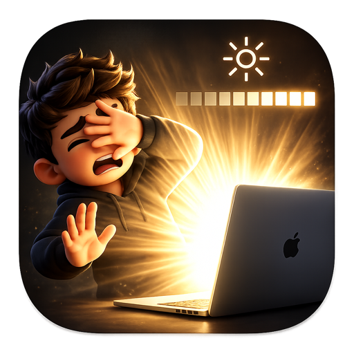

<p align="center">
  
</p>

<h1 align="center">BrightBoi</h1>

<p align="center">
  A free, native menu bar app that unlocks your MacBook Pro's real XDR brightness headroom —
  past the ceiling Control Center normally allows.
</p>

<p align="center">
  <a href="https://github.com/joaodavidsilva/brightboi/releases/latest"></a>
  
  <a href="LICENSE"></a>
  <a href="https://buymeacoffee.com/ncgeshq"></a>
</p>

---

## What it does

Macs with a Liquid Retina XDR display (the mini-LED MacBook Pros) have real brightness
headroom that Control Center never lets you touch — that headroom is reserved for XDR/HDR
video content, and third-party apps that unlock it for everyday use only exist as paid
downloads. BrightBoi gives you that same control for free, as a single continuous slider:

- **0–200% on one slider.** 100% still means exactly what Control Center's 100% has always
  meant (500 nits). 100–200% is **Extended Brightness / Boost**, unlocked via the same private
  APIs XDR video already uses, capped at a **Boost Ceiling of 1000 nits** — the panel's real
  sustained full-screen rating, not its 1600-nit peak-highlight spec that would just throttle
  back down under sustained use.
- **Auto-Brightness Takeover.** Disables macOS's ambient-light-sensor-driven auto-brightness on
  launch, so it can never silently override the level you chose.
- **5% steps** on both the slider and the physical brightness keys, so you always land on a
  clean, repeatable value.
- **Persists** your chosen level across sleep/wake, relaunch, and reboot, and **launches at
  login** so Auto-Brightness Takeover is active from the moment you log in.
- **Built-in display only** — never touches an external monitor.

Only available on Macs with an XDR (mini-LED) display. On a non-XDR Mac (e.g. MacBook Air),
BrightBoi still works, but the slider simply caps at 100% Nominal Brightness with no Boost UI,
since the physical backlight headroom Boost relies on doesn't exist there.

## Install

1. Download the latest `BrightBoi.zip` from [Releases](https://github.com/joaodavidsilva/brightboi/releases/latest).
2. Unzip it and drag `BrightBoi.app` into `/Applications`.
3. **First launch:** right-click (or Control-click) `BrightBoi.app` and choose **Open**, then
   confirm in the dialog that appears.

   This app isn't notarized yet (see [Known limitations](#known-limitations) below), so a plain
   double-click will be blocked by Gatekeeper with an "unidentified developer" warning. Opening
   it this way once is enough — macOS remembers your choice after that.
4. A sun icon appears in your menu bar. Click it for the brightness slider.
5. macOS will ask for **Accessibility** and **Input Monitoring** permissions (needed to remap
   the physical brightness keys) — grant both in System Settings when prompted.

## Known limitations

This is an early, actively-developed build — a few things aren't finished yet:

- **F1/F2 physical brightness keys don't fully work yet.** Pressing them still shows macOS's
  native brightness HUD instead of driving BrightBoi's 0–200% range. Use the menu bar slider in
  the meantime.
- **No in-app Quit button yet.** Quit via Activity Monitor (Force Quit) or `killall BrightBoi`
  until that ships.
- **Not notarized.** Builds are currently ad-hoc signed rather than signed with a Developer ID
  and notarized by Apple, since the app depends on private APIs the App Store disallows and a
  direct-distribution pipeline is still being finalized — hence the right-click-Open step above.
  This will change once proper signing is set up.

## Building from source

Requires Xcode / Swift toolchain for macOS 27+.

```bash
git clone https://github.com/joaodavidsilva/brightboi.git
cd brightboi
swift build                      # debug build
swift test                       # run the test suite
Packaging/build-app.sh release   # produce BrightBoi.app in .build/
```

## Why it's free

BrightBoi exists because the author wanted this feature and didn't want to pay for it —
paid alternatives (Vivid, Lunar) do more, but this covers the one thing that mattered.
If it's useful to you too and you'd like to say thanks:

<p align="center">
  <a href="https://buymeacoffee.com/ncgeshq">
    
  </a>
</p>

## License

[MIT](LICENSE)
