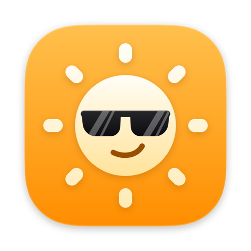

<p align="center">
  
</p>

<h1 align="center">BrightBoi</h1>

<p align="center">
  A free, native menu bar app that unlocks your MacBook Pro's real XDR brightness headroom —
  past the ceiling Control Center normally allows.
</p>

<p align="center">
  <a href="https://github.com/joaodavidsilva/brightboi/releases/latest"></a>
  
  <a href="LICENSE"></a>
  <a href="https://buymeacoffee.com/ptlghost"></a>
</p>

---

## What it does

Macs with a Liquid Retina XDR display (the mini-LED MacBook Pros) have real brightness
headroom that Control Center never lets you touch, and third-party apps that unlock it for
everyday use are mostly paid downloads. BrightBoi gives you that control for free, as a single
continuous slider:

- **0–200% on one slider.** 100% still means exactly what Control Center's 100% has always
  meant (about 500 nits on the 14-inch and 16-inch M1 Pro and M1 Max panels). 100–200% is
  **Extended Brightness / Boost**: a tiny invisible window keeps the display's extended
  dynamic range (EDR) headroom available, and BrightBoi scales the display's gamma table
  into it. Boost uses public macOS APIs (an invisible Metal overlay and
  `CGSetDisplayTransferByTable`) and needs no HDR content. The private frameworks BrightBoi
  loads are DisplayServices, for the 0–100% range, and CoreBrightness, for the auto-brightness
  switch. Nits figures in the app are estimates.
- **Adjustable Boost ceiling.** Settings lets you lower the top of the slider anywhere from
  100% to 200%. 200%, about 1000 nits, is the most BrightBoi offers: the panel's sustained
  full-screen rating, not its 1600-nit peak-highlight spec, which would just throttle back down
  under sustained use.
- **Brightness keys with an on-screen HUD.** The brightness keys (F1/F2) step 5% at a time across
  the whole range, and a HUD shows the level. In Settings you can remap them to any shortcut that
  includes a modifier key (Reset to F1/F2 brings the default back), or switch the remap off and
  hand the keys back to macOS.
- **Quick-set buttons.** Dim, 100% and Max boi jump straight to a level in the popover.
- **Advisories in the popover.** BrightBoi says so when the Key Remap is not active, the built-in
  display is off, Boost is paused (Invert Colors) or blocked by another app, brightness control
  is blocked or locked by a display preset, Low Power Mode is on, you are above 170% on battery
  power, or the Mac is running hot while boosted.
- **Auto-brightness takeover.** By default BrightBoi turns off macOS's ambient-light
  auto-brightness while it runs, so the light sensor cannot undo the level you chose, and
  restores your original setting when you quit. A switch in Settings turns this off.
- **Persists** your chosen level across sleep/wake, relaunch and reboot, and **launches at
  login** (on by default, with a switch in Settings).
- **First-run setup** walks through the Accessibility permission; "Skip — slider only" skips it.
- **Support window.** A short support prompt can appear a week after you first start BrightBoi and
  then at most once a month. It never takes focus from the app you are using. "Support
  BrightBoi…" in Settings opens it at any time.
- **Built-in display only** — never touches an external monitor.

Open Settings from **Settings…** in the popover (⌘, while the popover is open). If the
menu bar icon is hidden, opening BrightBoi again also opens Settings.

Boost is only available on Macs with an XDR (mini-LED) display. On a non-XDR Apple silicon
Mac (e.g. MacBook Air), BrightBoi still works, but the slider simply caps at 100% Nominal
Brightness with no Boost UI, since the physical backlight headroom Boost relies on doesn't
exist there.

## Requirements

- An Apple silicon Mac (M1 or later) running macOS 14 (Sonoma) or later. Intel Macs are not
  supported.
- For Boost (100–200%): a MacBook Pro with a Liquid Retina XDR display.

## Install

1. Download the latest zip (`BrightBoi-<version>.zip`) from [Releases](https://github.com/joaodavidsilva/brightboi/releases/latest).
2. Unzip it and drag `BrightBoi.app` into `/Applications`.
3. **First launch:** this app isn't notarized (see [Known limitations](#known-limitations)
   below), so macOS blocks the first launch until you approve it.
   - **macOS 15 and later:** double-click `BrightBoi.app` and click **Done** on the dialog
     (it says Apple could not verify "BrightBoi" is free of malware). Then open
     **System Settings > Privacy & Security**, scroll to the **Security** section and click
     **Open Anyway**, authenticate, and click **Open Anyway** again. The button appears only
     after a blocked launch attempt, and only for about an hour.
   - **macOS 14:** Control-click `BrightBoi.app`, choose **Open**, then confirm.
   - **Advanced:** after moving the app to `/Applications`, remove the quarantine flag instead:
     `xattr -dr com.apple.quarantine /Applications/BrightBoi.app`

   Doing this once is enough: macOS remembers your choice after that.
4. A sun icon appears in your menu bar. Click it for the brightness slider.
5. Grant **Accessibility** in the setup window, or later in **Settings > Permissions** (needed
   only for the brightness keys; if Settings also lists **Input Monitoring**, grant that too).
   Status updates while BrightBoi runs. If the keys still stay with macOS, use **Relaunch
   BrightBoi** in Settings. The slider and custom shortcuts work without these permissions.

## Updating

Quit BrightBoi (menu bar sun, then Settings > Quit), then replace `BrightBoi.app` in
`/Applications` with the new one and open it.

BrightBoi makes no network requests unless you ask it to. **Check for Updates…** in Settings
looks for a newer release on GitHub when you click it. From the second launch on, the popover
asks once whether BrightBoi may check automatically; if you say yes, it contacts github.com
(only) once a day, and you can change your mind with the "Check for updates automatically"
switch in Settings. When a newer release exists, the popover shows a row that opens its
download page.

## Known limitations

- **Hidden menu bar icon.** When the menu bar is full, macOS hides the items that don't fit,
  and on a MacBook Pro with a notch they can end up behind it. If BrightBoi's sun is missing,
  open BrightBoi again from Applications or Spotlight: it opens Settings, where you can change
  your options or quit. Quitting other menu bar apps, or switching off items in System Settings >
  Menu Bar, makes room for the icon again.
- **HDR highlights while boosted.** Boost scales the whole display, HDR video and photos
  included, so while the slider is above 100% their brightest highlights are lost. Boost is
  off at 100% and below.
- **Invert Colors.** With Invert Colors on, Boost is paused and the display stays at 100%,
  because scaling the gamma table can darken an inverted image on Apple silicon. It comes back
  when you turn Invert Colors off. Color Filters cannot be detected and are not handled.
- **One app per brightness key.** Only one app can own the brightness keys. If you also run
  MonitorControl, Lunar, BetterDisplay or BetterTouchTool with brightness-key handling on, the
  one that started last gets the keys and the other never sees them, so which one wins depends
  on launch order. When it can, BrightBoi notices a swallowed key press and says so in
  Settings, though it cannot always tell which app took it. To use both, turn off
  brightness-key handling in the other app, or turn off "Let BrightBoi own F1 / F2" in Settings.
- **Screen saver and lock screen.** Boost steps aside while the screen saver or lock screen
  covers the display, and returns when they end.
- **Other gamma and XDR tools.** Boost rewrites the built-in display's gamma table, so do not
  run it together with other tools that do the same, such as BrightIntosh, Lunar's software
  dimming, BetterDisplay's XDR upscaling or f.lux. Night Shift is not a known conflict.
- **Undocumented behaviour.** Boost relies on macOS behaviour that Apple has not documented,
  and the 0–100% range and the auto-brightness switch use private frameworks. A macOS update
  can break any of them.
- **After a crash.** A crash or force-quit skips the restore of macOS auto-brightness. BrightBoi
  keeps your original setting and restores it on the next clean quit. If auto-brightness looks
  stuck off, turn **Automatically adjust brightness** back on in System Settings > Displays.
- **Not notarized.** Releases are signed with an Apple Development certificate (a stable Team
  ID) but are not Developer ID-signed or notarized, so macOS blocks the first launch until you
  approve it (see [Install](#install)). Because the signing certificate will change once a
  Developer ID release ships, macOS may ask you to grant Accessibility and Input Monitoring to
  BrightBoi again after that update.

## Troubleshooting

**The brightness keys stopped working after an update.** macOS ties Accessibility and Input
Monitoring grants to the app's code signature, and a build signed differently counts as a new
app. In System Settings > Privacy & Security > Accessibility (and Input Monitoring, if
BrightBoi is listed there) select BrightBoi, click the minus button, relaunch BrightBoi and
grant the permission again. From Terminal instead:

```bash
tccutil reset Accessibility com.ptlghost.BrightBoi && tccutil reset ListenEvent com.ptlghost.BrightBoi
```

then relaunch BrightBoi.

## Uninstall

1. Turn off **Launch at login** in Settings.
2. Quit BrightBoi with its **Quit** button. This restores macOS auto-brightness.
3. Check **Automatically adjust brightness** in System Settings > Displays.
4. Delete `/Applications/BrightBoi.app`.
5. Optionally clear what it left behind. This also resets the first-run setup:

   ```bash
   tccutil reset Accessibility com.ptlghost.BrightBoi
   tccutil reset ListenEvent com.ptlghost.BrightBoi
   defaults delete com.ptlghost.BrightBoi
   ```

## Privacy

BrightBoi has no analytics and no accounts.

- **Network.** BrightBoi contacts nothing unless you ask it to. **Check for Updates…** in
  Settings, or the optional daily check you can switch on, asks github.com for the latest
  release. The only web pages it opens are that release page and the optional Buy Me a Coffee
  link, and only when you click them.
- **Keys.** The brightness keys are read as macOS media-key events, and a custom shortcut is
  registered with macOS as a hot key. Every other key press passes through unchanged. The
  Settings shortcut recorder reads a key only while a shortcut button is armed, and stops when
  you press Escape, click elsewhere, leave the window or after a timeout.
- **Logs.** Diagnostics go to the macOS unified log (subsystem `com.ptlghost.BrightBoi`, viewable
  in Console.app). They hold error codes and feature names, never key presses.
- **Preferences.** Settings are stored in `~/Library/Preferences/com.ptlghost.BrightBoi.plist`
  and contain your brightness level, Boost ceiling, shortcut, settings toggles, and small
  bookkeeping values (onboarding, support-prompt and update-check dates, launch count, and the
  panel's observed brightness headroom).

## Building from source

The app runs on macOS 14 (Sonoma) or later on Apple silicon. Building it requires Xcode 26 or
later (Swift 6.2), which itself needs macOS 15 or later; the deployment target stays macOS 14.

```bash
git clone https://github.com/joaodavidsilva/brightboi.git
cd brightboi
swift build                      # debug build
swift test                       # run the test suite
Packaging/build-app.sh           # debug bundle (com.ptlghost.BrightBoi.dev) in .build/
```

Signing matters for local builds. macOS ties the Accessibility and Input Monitoring grants to
the app's code signature. An ad-hoc signature is identified by the hash of that exact build, so
every rebuild loses the grants and the brightness keys silently stop working. Switching between
a local build and a release build needs the grants again for the same reason.
`Packaging/build-app.sh` picks a signing identity in this order: the `CODESIGN_IDENTITY`
environment variable, the first Developer ID Application certificate, the first Apple
Development certificate, and only then ad-hoc. A free Apple ID is enough for an Apple
Development certificate: in Xcode, open Settings > Accounts > Manage Certificates, click +, and
choose Apple Development. `security find-identity -v -p codesigning` lists what is installed.
`swift build` builds for the host architecture only.

`Packaging/build-app.sh` builds the debug bundle by default. It runs as **BrightBoi Dev**
with its own settings, so it does not touch an installed BrightBoi's preferences or login
item. It goes through onboarding again, and needs its own Accessibility and Input Monitoring
grants once. `defaults delete com.ptlghost.BrightBoi.dev` resets its state without touching
the installed release. Quit the installed BrightBoi before running a local build — both drive
the same display.

`Packaging/build-app.sh release` produces the shipping identity (`com.ptlghost.BrightBoi`).
It signs with a Developer ID or Apple Development certificate when one is installed and
refuses to fall back to ad-hoc signing, which would make macOS forget permission grants on
every build. Without a certificate, set `ALLOW_ADHOC_RELEASE=1` to build an ad-hoc signed
release bundle for local use only.

To publish a release, see the notes at the top of `Packaging/release.sh` and `CHANGELOG.md`.

CI builds and tests every push on macOS 15 (Xcode 26.0.1) and the newest hosted macOS with its
latest stable Xcode. macOS 14 is the minimum the app supports but is not covered by CI,
because GitHub has deprecated its macOS 14 runners.

## Support

If you find BrightBoi useful:

<p align="center">
  <a href="https://buymeacoffee.com/ptlghost">
    
  </a>
</p>

## License

[MIT](LICENSE)
